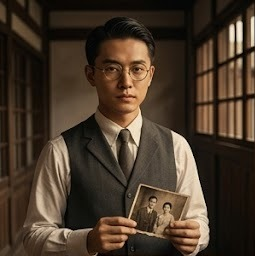

# 崁頂時空圖鑑｜12 位角色 AI 生成圖 Prompt

適用於 Midjourney、Higgsfield、DALL·E、Nano Banana、Stable Diffusion 等大多數文字生成圖片工具。
每張建議尺寸：**直式人像 3:4 或 2:3**（配合網頁 `avatar-placeholder` 200px 高的橫向卡片，也可裁切成橫式使用）。

---

## 共用風格錨點（建議加在每個 prompt 最前面或最後面，讓 12 張圖風格一致）

```
1944 Japanese-colonial-era Taiwan, Showa period, vintage documentary photography style,
warm sepia and amber tone, soft film grain, cinematic portrait lighting,
fictional character original artwork, not based on any real person,
--ar 3:4
```

如果想要「手繪／插畫風」而不是「寫實照片感」，把上面的 `vintage documentary photography style` 換成：
```
gouache illustration style, muted vintage color palette, painterly brush texture, editorial book-cover illustration
```

---

## 線路 A：血脈、信仰與禁忌之戀

### 1. 陳紹安（約26歲）｜陳鄉長直系後代 / 留洋知識青年
```
Portrait of a Taiwanese man in his mid-20s, 1944, wearing a dark grey waistcoat suit
with a white shirt and thin tie, round brass-rimmed glasses, neatly combed hair,
intellectual and melancholic expression, holding a half-torn old family photograph,
standing in a dim traditional Taiwanese courtyard house (古厝) interior with wooden lattice windows,
warm sepia tone, cinematic portrait lighting, fictional character, original artwork
--ar 3:4
```

### 2. 林婉吟（約24歲）｜鄉長昔日心上人的後代
```
Portrait of a gentle Taiwanese woman in her mid-20s, 1944, wearing a floral-print
Taiwanese qipao-style blouse (大襟衫) with traditional frog buttons, soft wavy short hair,
warm tender expression tinged with longing, holding an embroidered handkerchief with
a bun/pastry pattern, standing near a wooden window with soft afternoon light,
warm sepia tone, cinematic portrait lighting, fictional character, original artwork
--ar 3:4
```

### 3. 潘雨晴（約22歲）｜馬卡道族公廨傳承人
```
Portrait of a young Taiwanese Indigenous Makatao woman in her early 20s, 1944,
wearing a woven vest with Indigenous geometric totem patterns, clay bead necklace,
long dark hair, calm and spiritually grounded expression, standing in front of a
traditional public shrine (公廨) with rattan and thatch structures, dusk lighting,
warm earthy tone, cinematic portrait, fictional character, original artwork
--ar 3:4
```

### 4. 許明輝（約32歲）｜精通民俗風水的廟公
```
Portrait of a Taiwanese temple keeper in his early 30s, 1944, wearing a dark blue
traditional long robe (長衫), holding a translucent paper talisman glowing faintly
in candlelight, serious knowing expression, standing inside a dim Taiwanese folk
temple with an altar table in the background, warm amber candlelight,
cinematic portrait, fictional character, original artwork
--ar 3:4
```

### 5. 張福伯（約45歲）｜見證兩代恩怨的忠誠僕人
```
Portrait of a loyal Taiwanese elderly servant man in his mid-40s, 1944, wearing
a simple work apron over traditional clothing, holding an amber glass bottle of
sesame oil, weathered kind face with deep loyalty in his eyes, standing in a
traditional oil-pressing workshop with wooden beams, warm dim lighting,
cinematic portrait, fictional character, original artwork
--ar 3:4
```

### 6. 葉心怡（約25歲）｜洲子甜點農莊主人
```
Portrait of a warm Taiwanese woman in her mid-20s, 1944, wearing a vintage apron
over a simple blouse, gentle smile, holding a small fig tart on a plate,
standing in a rustic farmhouse kitchen with fresh figs on a wooden table,
soft natural daylight, warm sepia tone, cinematic portrait,
fictional character, original artwork
--ar 3:4
```

---

## 線路 B：戰爭、寶藏與戰地友情

### 7. 李志豪（約28歲）｜掌控糖鐵運輸的關鍵人物
```
Portrait of a determined Taiwanese railway worker in his late 20s, 1944, wearing
a blue work uniform and a railway conductor's cap, holding a brass train whistle,
steam and rail tracks in the background, resolute and brave expression,
warm sepia industrial tone, cinematic portrait lighting,
fictional character, original artwork
--ar 3:4
```

### 8. 周國平（約27歲）｜穿梭戰火的情報員
```
Portrait of a Taiwanese wartime courier in his late 20s, 1944, wearing a dark
olive-green postal/messenger uniform with a leather satchel bag, standing near
a concrete WWII-era Japanese pillbox bunker, alert and tense expression,
smoke haze in the background, desaturated wartime tone, cinematic portrait,
fictional character, original artwork
--ar 3:4
```

### 9. 方德文（約30歲）｜東港溪水利專家
```
Portrait of a Taiwanese hydraulic engineer in his early 30s, 1944, wearing a khaki
field jacket, holding an antique brass surveying compass, calm analytical expression,
standing near a riverbank with survey notebook tucked under his arm, golden hour
lighting, warm sepia tone, cinematic portrait, fictional character, original artwork
--ar 3:4
```

### 10. 孫采清（約26歲）｜救死扶傷的包紮員
```
Portrait of a Taiwanese wartime field nurse in her mid-20s, 1944, wearing a simple
white nurse's dress with a red cross armband, holding a vintage wooden first-aid box,
compassionate determined expression, dim field hospital tent background,
soft warm lighting, cinematic portrait, fictional character, original artwork
--ar 3:4
```

### 11. 陳健民（約29歲）｜守護在地糧食的農夫
```
Portrait of a Taiwanese farmer in his late 20s, 1944, wearing a straw hat and simple
farm clothing, carrying a bamboo shoulder pole with baskets of fresh vegetables,
warm honest smile, standing in a lush farmland field, golden afternoon sunlight,
warm sepia tone, cinematic portrait, fictional character, original artwork
--ar 3:4
```

### 12. 趙崇禮（約35歲）｜資助搶寶行動的暗黑大亨
```
Portrait of a wealthy Taiwanese businessman in his mid-30s, 1944, wearing a
pinstripe suit with a pocket watch chain, holding an ornate brass abacus,
sharp calculating expression with a hint of hidden warmth, dim opulent study
room background with dark wood furniture, dramatic side lighting,
cinematic portrait, fictional character, original artwork
--ar 3:4
```

---

## 使用建議

1. **保持風格一致**：12 張最好同一個工具、同一組風格關鍵字一次跑完，避免畫風不統一。
2. **檔名建議**：依網頁角色順序命名，例如 `char-01-chen-shao-an.jpg` ～ `char-12-zhao-chong-li.jpg`，方便之後直接對應到 HTML 裡的 `avatar-placeholder`。
3. **圖片生成後**，把 `avatar-placeholder` 的 `<div>` 換成：
   ```html
   
   ```
4. 若生成結果的臉部意外撞臉到真實名人，換一次種子（seed）重跑即可，避免使用近似真人肖像。
